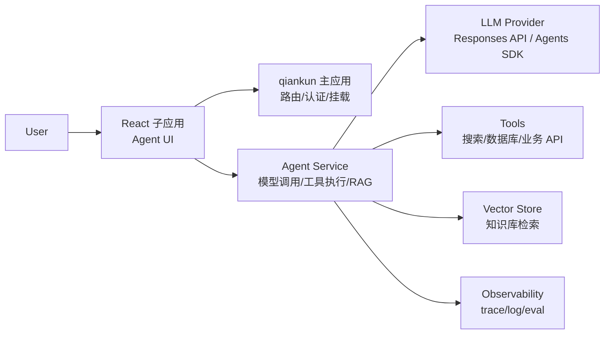

# React 子应用 AI Agent 学习计划

更新时间：2026-06-09

本文档面向当前 workspace 中的 `apps/react-dashboard` 子应用。当前子应用是 `Vite + React 18 + qiankun`，主要作为主应用 `/react-dashboard` 路由下挂载的前端页面。学习 AI Agent 时，建议把它定位成“Agent 交互与可观测 UI”，不要把模型密钥、工具执行和敏感业务逻辑直接放在浏览器端。

## 1. 学习目标

完成学习后，你应该能独立实现一个可运行的 AI Agent 原型：

- 在 React 子应用中实现流式对话、任务进度、工具调用结果、错误重试和人工确认 UI。
- 在服务端封装模型调用、工具执行、RAG 检索、日志追踪和权限控制。
- 理解 Agent 的核心组成：模型、指令、工具、状态、记忆、工作流、评测和安全边界。
- 能判断什么时候用简单单 Agent，什么时候引入 LangGraph、CrewAI、Pydantic AI 或其他编排框架。
- 能把 Agent 接入当前 qiankun 微前端，而不破坏主应用和其他子应用的路由、样式、生命周期。

## 2. 当前项目定位

当前仓库结构里和本计划直接相关的位置：

```text
apps/
  main/                 # qiankun 主应用，挂载子应用
  react-dashboard/      # React 子应用，AI Agent 学习主战场
    src/
      App.jsx           # 当前 dashboard 页面，后续可演进为 Agent Lab
      main.jsx          # qiankun mount/unmount 入口
      styles.css        # React 子应用样式
    docs/
      ai-agent-learning-plan.md
```

推荐后续新增一个服务端应用，用来承载 Agent 逻辑：

```text
apps/
  agent-service/        # 建议后续新增，承载模型调用和工具执行
    src/
      index.ts          # HTTP/SSE/WebSocket 入口
      agents/           # Agent 指令、模型配置、工作流
      tools/            # 工具实现，例如搜索、数据库、工单、报表
      rag/              # 文档切片、embedding、检索
      evals/            # 测试集和评测脚本
```

## 3. 核心原则

### 3.1 React 子应用负责什么

React 子应用适合负责：

- Agent 对话界面。
- 流式输出展示。
- 工具调用过程可视化。
- 人工确认弹窗，例如“是否允许发送邮件”。
- 文件上传、知识库选择、参数配置。
- trace、日志、token 用量、耗时、错误状态展示。
- qiankun 生命周期适配，例如进入 `/react-dashboard` 时挂载、切换子应用时清理请求和定时器。

### 3.2 React 子应用不应该负责什么

不要在 React/Vite 浏览器代码里做这些事：

- 保存 OpenAI 或其他模型供应商 API key。
- 直接调用需要密钥的模型接口。
- 执行有副作用的工具，例如发邮件、改数据库、创建工单。
- 绕过服务端权限校验。
- 把用户私密文档直接传给第三方服务而不经过后端策略控制。

原因很直接：`VITE_` 环境变量会进入前端构建产物，浏览器端任何密钥都不能视为安全。

### 3.3 推荐架构



最小可行路径：先做 React mock，再做 Agent Service，再逐步接真实模型和工具。

## 4. 推荐技术栈

### 4.1 前端

- React 18：沿用当前 `apps/react-dashboard`。
- Vite：沿用当前开发和构建链路。
- qiankun：保持当前 `main.jsx` 的 `renderWithQiankun` 入口。
- SSE 或 fetch stream：优先用于流式对话。
- AbortController：用于取消生成、切换子应用时清理请求。
- 状态管理：先用 React state/useReducer；复杂后再考虑 Zustand。

### 4.2 服务端

二选一即可：

- Node.js + TypeScript + Fastify/Express：和前端生态一致，适合学习流式 API、Vercel AI SDK、OpenAI JS SDK。
- Python + FastAPI：适合学习 RAG、数据处理、LangGraph、Pydantic AI。

如果你的目标是“React 子应用中快速看到效果”，建议先选 Node.js + TypeScript。  
如果你的目标是“深入 Agent 工作流和 RAG”，建议第二阶段补 Python + FastAPI。

### 4.3 Agent/API

建议按顺序学习：

1. 普通模型调用：理解 prompt、message、streaming、structured output。
2. Tool calling：让模型选择和调用工具。
3. Agent SDK：学习 handoff、trace、guardrail、session 等概念。
4. RAG：给 Agent 增加私有知识检索。
5. 工作流框架：复杂状态流转时再引入 LangGraph。

## 5. 10 周详细计划

### 第 1 周：理解当前 React 子应用和 Agent 基础

目标：搞清楚当前 React 子应用如何被 qiankun 挂载，并建立 Agent 基础概念。

学习内容：

- 阅读 `apps/react-dashboard/src/main.jsx`，理解 `bootstrap`、`mount`、`unmount`。
- 阅读 `apps/react-dashboard/src/App.jsx`，理解当前 dashboard 组件结构。
- 阅读 `apps/main/src/microApps.js`，理解 `/react-dashboard` 的 activeRule。
- 理解 Agent = 模型 + 指令 + 工具 + 状态 + 评测。
- 理解前端 UI 和后端 Agent runtime 的职责边界。

练习任务：

- 画出当前 React 子应用加载流程。
- 写一份“Agent 功能清单”，区分前端功能和服务端功能。
- 把当前 Revenue Dashboard 设想成 Agent Lab：需要哪些面板、按钮、状态和日志。

交付物：

- 一页架构草图。
- 一份功能拆分表。

验收标准：

- 能解释为什么 API key 不能放在 React 子应用。
- 能解释 qiankun 切换子应用时为什么要清理请求和副作用。

### 第 2 周：实现前端 Mock Chat UI

目标：不接真实模型，先在 React 子应用里做出 Agent 对话体验。

学习内容：

- React 组件拆分。
- 消息列表渲染。
- 输入框、发送、停止生成、重试。
- loading、error、empty、disabled 状态。
- useReducer 管理对话状态。

建议目录：

```text
apps/react-dashboard/src/
  agent/
    components/
      AgentChat.jsx
      MessageList.jsx
      Composer.jsx
      ToolCallPanel.jsx
      TracePanel.jsx
    state/
      conversationReducer.js
    mock/
      mockAgentStream.js
```

练习任务：

- 点击发送后，用 mock stream 模拟逐字输出。
- 加入“停止”按钮，用 AbortController 终止输出。
- 展示一条模拟工具调用记录，例如 `search_docs`。
- 切换路由或 unmount 时清理未完成请求。

交付物：

- 一个可独立运行的前端 Agent Lab 页面。

验收标准：

- `pnpm dev:react-dashboard` 下可访问。
- `http://localhost:7100/react-dashboard` 下由主应用挂载也能运行。
- 停止生成后不会继续写入消息。

### 第 3 周：搭建 Agent Service 最小后端

目标：建立安全的服务端边界，让 React 子应用通过自己的后端调用模型。

学习内容：

- BFF/API service 基础。
- POST `/api/agent/chat`。
- SSE 或 streaming response。
- 服务端环境变量管理。
- 基础错误处理和请求日志。

建议目录：

```text
apps/agent-service/
  package.json
  src/
    index.ts
    routes/
      chat.ts
    config/
      env.ts
```

练习任务：

- 新增 `apps/agent-service`。
- 实现一个 mock 的 `/api/agent/chat`，先不接真实模型。
- React 子应用从 mock 本地函数切换成调用后端接口。
- 为 React 子应用增加 `VITE_AGENT_API_BASE_URL`，只保存服务端地址，不保存模型 key。

交付物：

- React 子应用可以通过 Agent Service 获取流式回复。

验收标准：

- 浏览器源码中找不到模型 API key。
- 后端服务停止时，React 子应用能展示清晰错误。

### 第 4 周：接入真实模型调用

目标：通过服务端接入真实模型，完成基础问答。

学习内容：

- OpenAI Responses API 或 Agents SDK 的基本调用方式。
- system/developer/user 指令分层。
- streaming 输出。
- structured output。
- 请求超时、重试、错误分类。
- token 和成本记录。

练习任务：

- 在 Agent Service 中封装 `modelClient`。
- 实现普通对话。
- 实现一个结构化输出任务，例如“把用户需求拆成目标、约束、风险、下一步”。
- 前端展示 token 用量和耗时。

交付物：

- 可与真实模型对话的 React Agent Lab。

验收标准：

- 模型调用只发生在服务端。
- 前端能展示生成中、成功、失败、取消四类状态。
- 服务端能记录每次请求的 request id、耗时和模型名。

### 第 5 周：Tool Calling

目标：让 Agent 可以调用工具，而不仅是聊天。

学习内容：

- 工具 schema。
- 工具参数校验。
- read-only 工具和 write 工具分级。
- 人工确认机制。
- 工具失败重试和降级。

建议先实现三个工具：

```text
search_dashboard_metrics     # 只读：查询模拟指标
summarize_region_revenue     # 只读：汇总区域收入
create_followup_task         # 写操作：必须人工确认
```

练习任务：

- 服务端定义工具 schema。
- 模型决定是否调用工具。
- 前端展示工具调用卡片：工具名、参数、状态、结果。
- 写操作进入 pending confirmation，用户确认后服务端才执行。

交付物：

- Agent 能根据用户问题查询 dashboard 数据。
- Agent 在写操作前会请求确认。

验收标准：

- 工具参数必须经过服务端校验。
- 工具执行失败时前端能看到失败原因。
- 未确认的写操作不会执行。

### 第 6 周：RAG 知识库

目标：让 Agent 能基于项目文档或业务文档回答问题。

学习内容：

- 文档切片 chunking。
- embedding。
- 向量检索。
- rerank 或简单相似度排序。
- 引用来源展示。
- 检索失败时的回答策略。

建议知识来源：

```text
README.md
docs/optimization-plan.md
apps/react-dashboard/docs/ai-agent-learning-plan.md
```

练习任务：

- 做一个文档 ingest 脚本。
- 建立本地向量索引。
- 实现 `search_project_docs` 工具。
- 前端在回答下方展示引用文件和片段。

交付物：

- 项目知识库问答 Agent。

验收标准：

- 回答项目问题时能给出引用来源。
- 找不到依据时明确说不知道，不编造。
- 引用路径能定位到具体文档。

### 第 7 周：Agent 状态机和任务工作流

目标：从“聊天机器人”升级到“可执行任务的 Agent”。

学习内容：

- plan -> act -> observe -> answer。
- 状态机。
- 长任务进度。
- 中断和恢复。
- human-in-the-loop。

练习任务：

- 实现“生成 React 子应用优化建议”的任务型 Agent。
- 让 Agent 先生成计划，再执行文档检索，再输出报告。
- 前端展示步骤列表：待执行、执行中、成功、失败。
- 用户可以在执行前编辑计划。

交付物：

- 一个可视化任务工作流 Agent。

验收标准：

- 每一步都有状态和日志。
- 用户能在关键步骤前确认或取消。
- 工具失败后 Agent 能给出可理解的恢复建议。

### 第 8 周：评测、测试和回归保护

目标：避免 Agent 改一次 prompt 就行为大变。

学习内容：

- 构建小型 eval dataset。
- 断言结构化输出。
- 检查引用来源。
- 工具调用路径测试。
- Playwright 冒烟测试。

建议测试集：

```text
agent-service/evals/cases/
  basic-chat.json
  tool-calling.json
  rag-project-docs.json
  safety-confirmation.json
```

练习任务：

- 为常见问题写 20 条测试用例。
- 检查回答是否包含引用。
- 检查写操作是否触发人工确认。
- 给 React Agent Lab 增加基本 e2e 测试。

交付物：

- 一套最小 eval + e2e 测试。

验收标准：

- `pnpm check` 或单独命令能跑通核心检查。
- Agent 的关键行为有回归保护。

### 第 9 周：qiankun 集成强化

目标：让 Agent Lab 更适合在微前端里运行。

学习内容：

- qiankun props 传参。
- 主应用认证状态传递。
- 子应用 unmount 清理。
- 样式边界。
- 跨子应用路由切换。

练习任务：

- 从主应用传入 `userId`、`tenantId`、`traceId` 等模拟 props。
- React 子应用请求 Agent Service 时带上必要上下文。
- unmount 时取消 stream、清理定时器、关闭订阅。
- 增加从 Vue 子应用切换到 React Agent Lab 的冒烟测试。

交付物：

- 微前端场景下稳定运行的 Agent Lab。

验收标准：

- 子应用切换后没有残留请求继续写 UI。
- 主应用和其他子应用样式不被污染。
- e2e 覆盖 `/react-dashboard` 挂载路径。

### 第 10 周：生产化和复盘

目标：把学习原型整理成可以继续扩展的工程基础。

学习内容：

- 配置分层：本地、测试、生产。
- 日志脱敏。
- 速率限制。
- 成本上限。
- 权限模型。
- 数据保留策略。
- 发布检查清单。

练习任务：

- 给 Agent Service 加 rate limit。
- 对日志中的用户输入和工具结果做脱敏策略。
- 给模型调用设置超时和最大 token。
- 整理 README 和架构图。
- 写一份复盘：哪些功能应该产品化，哪些只是学习 demo。

交付物：

- 一个可演示、可回归测试、边界清晰的 AI Agent 学习项目。

验收标准：

- 能独立演示完整链路：提问 -> 检索/工具 -> 模型生成 -> 引用/trace -> 人工确认。
- 能说明项目的安全边界和已知限制。

## 6. 阶段性里程碑

| 阶段 | 周期       | 重点           | 最小交付               |
| ---- | ---------- | -------------- | ---------------------- |
| M1   | 第 1-2 周  | React Agent UI | Mock 流式聊天页面      |
| M2   | 第 3-4 周  | 服务端模型调用 | 安全的真实模型问答     |
| M3   | 第 5 周    | 工具调用       | Dashboard 数据查询工具 |
| M4   | 第 6 周    | RAG            | 项目文档问答           |
| M5   | 第 7 周    | 工作流         | 可视化任务步骤         |
| M6   | 第 8-10 周 | 评测和生产化   | eval、trace、安全清单  |

## 7. 每周学习节奏

建议每周投入 5 到 8 小时：

- 1 小时：阅读官方文档和示例。
- 1 小时：阅读当前项目相关源码。
- 2 到 4 小时：实现本周练习。
- 1 小时：测试、记录问题、整理复盘。
- 30 分钟：补齐文档和下一步计划。

每天推进时建议固定三件事：

1. 明确今天只完成一个可验证的小目标。
2. 结束前跑一次对应检查，例如 `pnpm dev:react-dashboard` 或 `pnpm check`。
3. 记录一个失败案例，后续把它加入 eval。

## 8. 推荐实现路线

### 路线 A：最快看到效果

适合目标：想在 React 子应用里尽快看到 Agent 交互。

顺序：

1. React mock stream。
2. Node Agent Service mock stream。
3. 接真实模型 streaming。
4. 加 tool calling。
5. 加 RAG。

优点：反馈快，和当前 Vite/React 项目贴合。  
缺点：一开始不够深入，复杂工作流需要后续补课。

### 路线 B：偏工程化

适合目标：想构建可维护的 Agent 工程。

顺序：

1. Agent Service 优先。
2. 完成模型调用、工具、eval。
3. React 只做 UI。
4. 最后接 qiankun 集成和 e2e。

优点：边界清晰，安全性和测试更好。  
缺点：前期 UI 反馈慢。

### 路线 C：偏工作流研究

适合目标：想学习长任务、多步骤、人类介入、状态恢复。

顺序：

1. Python/FastAPI Agent Service。
2. LangGraph 或 Pydantic AI。
3. React 可视化状态机。
4. RAG 和 eval。

优点：更接近复杂 Agent。  
缺点：技术栈跨度更大。

推荐从路线 A 开始，在第 5 周之后吸收路线 B 的工程化做法。

## 9. 功能拆分建议

### React 子应用模块

```text
src/agent/
  api/
    agentClient.js              # 请求 Agent Service
  components/
    AgentShell.jsx              # Agent Lab 页面骨架
    ConversationPanel.jsx       # 对话区
    MessageBubble.jsx           # 单条消息
    Composer.jsx                # 输入区
    ToolCallPanel.jsx           # 工具调用区
    TracePanel.jsx              # trace/log 区
    KnowledgeSourcePanel.jsx    # 知识库来源
  hooks/
    useAgentStream.js           # 流式请求和取消
    useConversationState.js     # 消息状态
  state/
    conversationReducer.js
  mock/
    mockAgentStream.js
```

### Agent Service 模块

```text
src/
  routes/
    chat.ts
    tools.ts
    documents.ts
  agents/
    dashboardAgent.ts
    instructions.ts
  tools/
    searchDashboardMetrics.ts
    summarizeRegionRevenue.ts
    createFollowupTask.ts
    searchProjectDocs.ts
  rag/
    ingest.ts
    chunk.ts
    retrieve.ts
  evals/
    runEval.ts
    cases/
```

## 10. UI 能力清单

React Agent Lab 至少应该包含：

- 会话列表：新建、切换、删除。
- 消息区：user、assistant、tool、system event 四类展示。
- 输入区：发送、停止、重试、清空。
- 工具调用区：工具名、参数、执行状态、耗时、结果摘要。
- 人工确认：写操作必须确认。
- 知识来源：RAG 回答展示引用文档。
- 任务步骤：复杂任务展示 plan/act/observe。
- Trace 面板：request id、model、token、latency、error。
- 设置面板：模型、temperature、知识库范围、是否启用工具。

## 11. 安全清单

每次新增 Agent 能力，都检查：

- API key 是否只在服务端读取。
- 工具参数是否有 schema 校验。
- 写操作是否需要人工确认。
- 服务端是否验证用户身份和权限。
- 日志是否避免保存密钥、token、身份证号、手机号等敏感信息。
- RAG 是否能拒绝越权文档。
- Prompt injection 是否可能诱导工具越权。
- 模型输出是否被当作可信代码或 SQL 直接执行。
- 是否设置请求超时、最大 token、速率限制和成本上限。
- 子应用 unmount 时是否取消未完成请求。

## 12. 评测清单

建议最早从 20 条用例开始：

| 类别     | 用例数 | 检查点                               |
| -------- | -----: | ------------------------------------ |
| 基础问答 |      5 | 能回答、无异常、格式稳定             |
| 工具调用 |      5 | 调用正确工具、参数正确、结果进入回答 |
| RAG      |      5 | 有引用、不编造、找不到时承认不知道   |
| 安全     |      3 | 写操作确认、拒绝越权、拒绝泄露密钥   |
| 前端交互 |      2 | 停止生成、错误重试                   |

## 13. 推荐资料

- OpenAI Agents guide: https://platform.openai.com/docs/guides/agents
- OpenAI Function calling guide: https://platform.openai.com/docs/guides/function-calling
- OpenAI Agents SDK: https://openai.github.io/openai-agents-js/
- Vercel AI SDK UI: https://ai-sdk.dev/docs/ai-sdk-ui
- Vercel AI SDK tool calling: https://ai-sdk.dev/docs/ai-sdk-core/tools-and-tool-calling
- LangGraph JS docs: https://docs.langchain.com/oss/javascript/langgraph/overview
- Pydantic AI docs: https://ai.pydantic.dev/

## 14. 下一步建议

如果只做一个最小闭环，建议从下面 5 个任务开始：

1. 在 `apps/react-dashboard/src` 下新增 `agent` 目录。
2. 把当前 `App.jsx` 改成 Agent Lab 页面骨架。
3. 用 mock stream 实现一问一答和停止生成。
4. 新增工具调用展示卡片，但先用模拟数据。
5. 再新增 `apps/agent-service`，把 mock stream 移到服务端。

做到这一步后，再接真实模型会更稳，因为 UI 状态、取消逻辑和微前端生命周期已经先被验证过。
